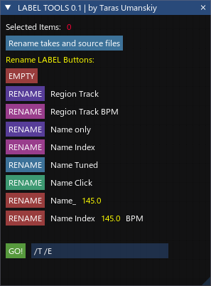

[⬅️ На главную (Main)](../README.md)

# GUI Tools: trs_Label GUI Tools

**Автор:** Taras Umanskiy
**Версия:** 1.0.1
**Лицензия:** Metapackage
**Ссылка:** [GitHub](https://github.com/Tarasmetal/ReaScripts)
**Поддержка:** [VK](https://vk.com/Tarasmetal)

## Описание

**trs_Label GUI Tools** — это скрипт для REAPER, предоставляющий удобный графический интерфейс (на базе библиотеки ReaImGui) для управления и редактирования меток (имен айтемов/тейков) в проекте.

Инструмент позволяет быстро переименовывать группы выделенных айтемов, используя информацию о треке, регионе и темпе проекта (BPM), а также выполнять другие полезные операции с именами файлов.

## Требования

Для работы скрипта необходимы:
* **REAPER DAW** (Windows x64 / macOS)
* **ReaImGui** (устанавливается через ReaPack)
* **SWS Extension** (рекомендуется для полного функционала)
* Наличие файла функций `Functions/LabelFunctions.lua` в папке скрипта.

## Основные возможности

### Информационная панель
* Отображение количества **выделенных айтемов** (цветовая индикация в зависимости от количества).
* Отображение текущего **BPM** (Master Tempo) проекта.

### Инструменты переименования (Пресеты)
Скрипт содержит набор кнопок для быстрого переименования выделенных айтемов по заданным шаблонам:

* **EMPTY**: Очистка имени.
* **RENAME Region Track**: Шаблон `/r /T` (Имя региона + Имя трека).
* **RENAME Region Track BPM**: Шаблон `/r /T [BPM]` (Имя региона + Имя трека + Темп).
* **RENAME Name Only**: Шаблон `/T` (Только имя трека).
* **RENAME Name Index**: Шаблон `/T_/E` (Имя трека + Индекс).
* **RENAME Name Tuned**: Добавляет пометку "Tunned".
* **RENAME Name Click**: Добавляет пометку "Click".
* **RENAME Name_ [BPM]**: Имя трека + Темп.
* **RENAME Name Index [BPM]**: Имя трека + Индекс + Темп.

### Ручное управление
* Текстовое поле для ввода произвольных шаблонов переименования (например, `/T /E`).
* Кнопка **GO!** для применения введенного шаблона.

### Дополнительно
* Интеграция с командой SWS: **Rename takes and source files** (позволяет переименовывать исходные файлы).

## Использование

1. Выделите один или несколько медиа-айтемов (Media Items) в окне аранжировки REAPER.
2. Запустите скрипт `trs_Label GUI Tools.lua`.
3. В появившемся окне выберите нужный пресет нажатием на соответствующую кнопку.
4. Имена айтемов будут мгновенно обновлены согласно выбранному шаблону.
5. Для произвольного переименования введите шаблон в текстовое поле внизу и нажмите **GO!**.

## Условные обозначения шаблонов (Pattern Symbols)

Скрипт поддерживает следующие символы подстановки для формирования имен:

### Основные
* `/T` — Имя трека (Track Name).
* `/t` — Номер трека (Track Number).
* `/r` — Имя региона, в котором находится айтем (Region Name).
* `$notes` — Текущий текст заметок айтема (Item Notes).
* `\n` — Символ переноса строки.

### Нумерация (Counters)
* `/E` — Глобальная нумерация по всем выделенным айтемам (1, 2, 3...).
* `/e` — Локальная нумерация айтемов в пределах каждого трека.
* `/I` — Обратная глобальная нумерация (от последнего к первому).
* `/i` — Обратная локальная нумерация (в пределах трека).

### Расширенная настройка нумерации
Для счетчиков (`/E`, `/e`, `/I`, `/i`) поддерживается расширенный формат для указания количества цифр (нулей) и смещения (offset):

**Синтаксис:** `/SymbolDigits_Offset_`

* `Digits` — количество цифр (ведущие нули).
* `Offset` — число, которое прибавляется к счетчику.

**Примеры:**
* `/E` — обычная нумерация: 1, 2, 3...
* `/E02_0_` — два знака: 01, 02, 03...
* `/E03_10_` — три знака, начало с 11 (1 + 10): 011, 012, 013...

---

## Список изменений (Changelog)
* **1.0.1**
    * Исправлены ссылки и названия файлов.
