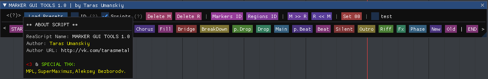

[⬅️ На главную (Main)](../README.md)

# 🤖 REAPER — Marker GUI Tools

> **Профессиональный инструмент для работы с маркерами и навигации в проектах REAPER.**  
> Скрипт позволяет максимально сократить время на разметку проекта, оставляя его красивым и понятным. Не отвлекайтесь от творческого процесса — перемещайтесь в любую точку проекта и ставте маркеры с уже подготовленными именами  за пару секунд.

<!--  -->

---

## 📋 Информация о скрипте

| Параметр | Значение |
| :--- | :--- |
| **Автор** | Taras Umanskiy |
| **Версия** | 2.1.1 |
| **Язык** | Lua |
| **Требования** | REAPER, ReaImGui, SWS Extension |
| **Ссылка** | [vk.com/tarasmetal](http://vk.com/tarasmetal) |
| **Поддержка** | [Donation](https://vk.com/Tarasmetal) |

---

## 🚀 Основные возможности

### 1. Управление маркерами
* **Быстрый доступ**: Создавайте маркеры одним кликом из настраиваемого списка.
* **Drag & Drop**: Легко меняйте порядок кнопок маркеров в интерфейсе простым перетаскиванием.
* **START / END**: Специальные кнопки для быстрой установки маркеров начала (`=START`) и конца (`=END`) проекта.
* **Редактирование**:
    * **ПКМ (Правая кнопка мыши)** на кнопке маркера открывает меню редактирования.
    * Изменяйте имя, цвет, удаляйте или вставляйте новые маркеры.
* **Только маркеры (Mode 'H')**: Нажмите клавишу `H`, чтобы скрыть все лишние инструменты и оставить только кнопки маркеров для минималистичного вида.

### 2. Пресеты и настройки
* **Система пресетов**: Скрипт поддерживает загрузку и сохранение наборов маркеров.
    * Маркеры хранятся в папке `MarkerPresets`.
    * Текущий пресет запоминается при перезапуске.
* **Настройка цветов**: Вы можете настроить цвета кнопок START/END через контекстное меню.
* **ID Маркеров**: Опция `ID` позволяет скрывать или показывать идентификаторы маркеров в REAPER (через ExtState).

### 3. Дополнительные инструменты (Custom Buttons)
Скрипт включает в себя мощную панель инструментов (скрывается за кнопкой `<`), которая предоставляет доступ к функциям SWS и кастомным экшенам:

| Группа | Функции |
| :--- | :--- |
| **Set** | Установка START/END по выделению времени. |
| **Delete** | Удаление маркеров темпа, маркеров или регионов (по курсору или всех). |
| **Convert** | Конвертация: Маркеры ↔ Регионы. |
| **Renumber** | Перенумерация ID маркеров и регионов. |
| **Index** | Добавление/удаление индексов в именах маркеров. |
| **Time** | Установка 0:00:00, сброс времени проекта. |
| **PlayBack** | Инструменты для работы с PlayBack (опция `PB`). |

---

## 🎮 Управление и Горячие клавиши

### Клавиатура
* **`H`** — Переключение режима "Только маркеры" (Minimalist View).
* **`Esc`** — Закрыть скрипт (если фокус на окне).

### Мышь
* **ЛКМ (Левый клик)** — Вставить маркер / Выполнить действие.
* **ПКМ (Правый клик)** — Контекстное меню (Редактирование кнопки, цвета, удаление).
* **Drag & Drop** — Перетаскивание кнопок маркеров для изменения их порядка.

---

## ⚙️ Установка и Требования

Для корректной работы скрипта убедитесь, что у вас установлены:
1.  **ReaImGui**: Библиотека для отрисовки интерфейса (устанавливается через ReaPack).
2.  **SWS Extension**: Необходим для работы многих функций управления маркерами и регионами.

**Файловая структура:**
* `trs_Marker GUI Tools.lua` — Основной скрипт.
* `Functions/` — Папка с библиотеками функций (`PresetFileLoadFunctions.lua`, `MarkerFunctions.lua`).
* `MarkerPresets/` — Папка для хранения пресетов маркеров.

---

## 📜 История изменений (Changelog)

### v2.1.1
* `+` Исправлены ссылки и названия файлов.

### v2.1
* `+` Добавлена горячая клавиша **"H"** для переключения в минималистичный режим (отображаются только маркеры).
* `+` Маркеры **START/END** теперь используют цвета, заданные в GUI (настраиваются через ПКМ).
* `+` Оптимизация кода.

---

  
Created with ❤️ by Taras Umanskiy

