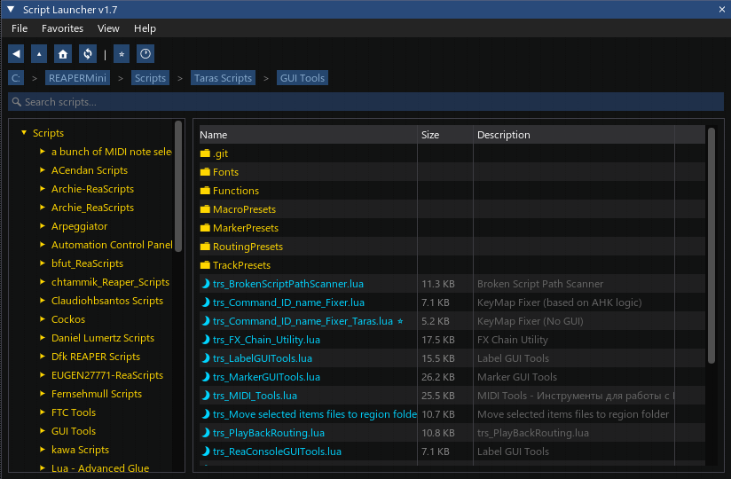

[⬅️ На главную (Main)](../README.md)
# trs_Script Launcher

**trs_Script Launcher** — это мощный файловый менеджер и лаунчер скриптов для REAPER, созданный для удобной навигации, быстрого поиска и запуска скриптов.

<!-- *(Замените `img/script_launcher.png` на реальный скриншот, если он есть)* -->

## ✨ Основные возможности

*   **Файловый менеджер:** Удобное дерево папок для навигации по директории Scripts (поддержка вложенности до 5 уровней).
*   **Умный поиск:** Фильтрация скриптов и папок по имени в реальном времени.
*   **Избранное (Favorites):**
    *   Добавление часто используемых скриптов в избранное.
    *   Добавление папок в избранное для быстрого перехода.
    *   Добавление произвольных (кастомных) путей к файлам или папкам.
    *   Папки в избранном подсвечиваются белым цветом, скрипты — цветом соответствующего языка.
*   **История (History):**
    *   Автоматическое сохранение истории запущенных скриптов (до 20 последних).
    *   Быстрый перезапуск скриптов из истории.
*   **Информационная панель:** Отображение детальной информации о выбранном скрипте:
    *   Описание (`@description`)
    *   Автор (`@author`)
    *   Версия (`@version`)
    *   Размер файла
*   **Поддержка форматов:** Распознавание и цветовая кодировка для `.lua` (синий), `.eel` (оранжевый) и `.py` (синий/зеленый).
*   **Удобное управление:** Поддержка клавиатурной навигации и горячих клавиш.
*   **Внешний редактор:** Возможность настройки и запуска скриптов во внешнем редакторе (IDE).
*   **Автосохранение:** Скрипт запоминает последнюю открытую папку, историю, избранное и настройки при закрытии.

## 🚀 Использование

### Навигация
*   Используйте дерево папок слева или кликайте по папкам в списке файлов для навигации.
*   Панель "хлебных крошек" (breadcrumbs) сверху позволяет быстро вернутся на уровни выше.
*   Кнопки навигации: `◀` (Назад), `🔼` (Вверх), `🏠` (Домой - папка Scripts).

### Управление файлами
*   **Двойной клик** по скрипту запускает его.
*   **Двойной клик** по папке открывает её.
*   **Правый клик** по элементу открывает контекстное меню:
    *   `Run` — Запустить скрипт.
    *   `Edit` — Открыть в редакторе.
    *   `Add/Remove Favorites` — Добавить/удалить из избранного.

### Горячие клавиши (Keyboard Shortcuts)
| Клавиша | Действие |
| :--- | :--- |
| `↑` / `↓` | Навигация по списку файлов |
| `Enter` | Открыть папку / Запустить скрипт |
| `F5` | Обновить список файлов (Refresh) |
| `Esc` | Закрыть окно (если фокус на окне и нет активного ввода) |

## ⚙️ Настройки (Settings)

Доступ к настройкам осуществляется через меню `File > Settings...`.

*   **External Editor Path:** Путь к исполняемому файлу внешнего редактора (например, VS Code, Notepad++). Если оставить пустым, будет использоваться системное приложение по умолчанию.
*   Настройки сохраняются в файл `trs_Script_Launcher.ini` рядом со скриптом.

## 📝 Примечания
*   Скрипт требует установленной библиотеки **ReaImGui**.
*   Поддерживаются файлы с расширениями: `.lua`, `.eel`, `.py`.

---

## Список изменений (Changelog)
* **1.0.1**
    * Исправлены ссылки и названия файлов.
