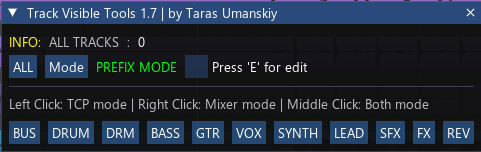

[⬅️ На главную (Main)](../README.md)

# trs_TCP MCP Visible Tools

> **Профессиональный менеджер видимости треков для REAPER.**  
> Мгновенно фильтруйте треки в окне аранжировки (TCP) и микшере (MCP) с помощью настраиваемых кнопок-тегов.

---

---

| Информация | Значение |
| :--- | :--- |
| **Автор** | Taras Umanskiy |
| **Версия** | 1.10.1 |
| **Технология** | Lua, ReaImGui |
| **Лицензия** | MIT / Proprietary (см. репозиторий) |
| **Ссылки** | [GitHub](https://github.com/Tarasmetal/ReaScripts) \| [Donation](https://vk.com/Tarasmetal) |

---

## 📖 Описание

Этот скрипт решает проблему навигации в больших проектах. Вместо ручного поиска треков, вы можете создать кнопки для каждой группы инструментов (например, `DRUM`, `BASS`, `VOX`) и мгновенно переключать видимость.

Уникальность инструмента заключается в гибком управлении зонами видимости: вы можете оставить барабаны только в микшере, вокал — только в аранжировке, или сфокусироваться на группе полностью, скрыв всё остальное.

## ✨ Ключевые возможности

### 🎯 Умная фильтрация
*   **Prefix Mode:** Поиск треков, чьи имена *начинаются* с заданного слова (например, "DRUM" найдет "DRUM Kick", "DRUM Snare").
*   **Suffix Mode:** Поиск треков, чьи имена *заканчиваются* на слово (полезно, если вы именуете треки как "Kick (DRM)", "Snare (DRM)").

### 🖱️ Три режима изоляции (Mouse Logic)
Скрипт по-разному реагирует на тип клика мышью, позволяя управлять TCP и MCP независимо:

1.  **Левый клик (TCP Mode):**
    *   Выбранная группа остаётся в **TCP** (Аранжировке). Остальные треки скрываются из TCP.
    *   В Микшере (MCP) остаются видимы **все** треки.
2.  **Правый клик (Mixer Mode):**
    *   Выбранная группа остаётся в **MCP** (Микшере). Остальные треки скрываются из Микшера.
    *   В TCP остаются видимы **все** треки.
3.  **Средний клик / Колесо (Both Mode):**
    *   Выбранная группа изолируется **везде** (и в TCP, и в MCP).
    *   Все остальные треки полностью скрываются.

### 🛠️ Полная кастомизация (Edit Mode)
Вам не нужно лезть в код, чтобы изменить кнопки. Нажмите клавишу **`E`**, чтобы войти в режим редактирования:
*   **Переименование:** Правый клик по кнопке -> измените имя.
*   **Сортировка:** Перетаскивайте кнопки (Drag & Drop) для изменения порядка.
*   **Добавление/Удаление:** Добавляйте новые теги или удаляйте ненужные через контекстное меню.
*   Все настройки сохраняются автоматически в файл `trs_TCP MCP Visible Tools.ini`.

## 🎮 Управление и Горячие клавиши

| Клавиша / Действие | Функция |
| :--- | :--- |
| **`E`** | Вкл/Выкл режим редактирования кнопок (Edit Mode) |
| **`M`** | Переключение режима поиска (Prefix ↔ Suffix) |
| **`Esc`** | Закрыть скрипт |
| **Удержание `Ctrl`** | Временное переключение в режим Suffix (пока клавиша нажата) |
| **Удержание `Shift`** | **Режим Мульти-выбора (Multi).** Добавляет группу к уже видимым трекам, не скрывая остальные. |
| **Удержание `Alt`** | Показать все треки (аналог кнопки ALL) |

## ⚙️ Требования

Для работы скрипта необходимо наличие следующих расширений:

1.  **REAPER** (версия 6.x или 7.x).
2.  **ReaImGui**: библиотека для отрисовки интерфейса (устанавливается через ReaPack).

## 📂 Файловая структура

*   `trs_TCP MCP Visible Tools.lua`: Основной файл скрипта.
*   `trs_TCP MCP Visible Tools.ini`: Файл конфигурации (создается автоматически), где хранится список и порядок ваших кнопок.

---

## Список изменений (Changelog)
* **1.10.1**
    * Исправлены ссылки и названия файлов.
