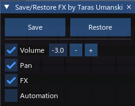

[⬅️ На главную (Main)](../README.md)

# trs_Track vol pan fx auto Save Restore

> **Мощный инструмент для управления снимками микса в REAPER.**  
> Сохраняйте и восстанавливайте настройки громкости, панорамы и эффектов одним кликом.

---

---

| Информация | Значение |
| :--- | :--- |
| **Автор** | Taras Umanskiy |
| **Технология** | Lua, ReaImGui |
| **Лицензия** | MIT / Proprietary (см. репозиторий) |
| **Ссылки** | [GitHub](https://github.com/Tarasmetal/ReaScripts) \| [Donation](https://vk.com/Tarasmetal) |

---

## 📖 Описание

Этот скрипт предназначен для звукорежиссеров и продюсеров, работающих в REAPER. Он позволяет **сохранять текущее состояние микса** (громкость, панорама, статус FX) в файл и **восстанавливать его** в любой момент. 

Это особенно полезно для:
- **A/B сравнения**: быстрое переключение между текущим миксом и "сброшенным" состоянием.
- **Подготовки стемов**: временное отключение обработок и выравнивание уровней.
- **Экспериментов**: сохранение "точки возврата" перед внесением кардинальных изменений.

Данные сохраняются в текстовый файл `TrackMixSnap.txt`, который создается непосредственно в папке проекта, что обеспечивает переносимость вместе с проектом.

## ✨ Основные возможности

### 🎛️ Управление параметрами
Скрипт позволяет гибко выбирать, какие именно параметры нужно сохранять и восстанавливать:

*   **Volume (Громкость):** Сохраняет точные значения фейдеров. При нажатии *Save* все треки устанавливаются в заданный пользователем уровень (по умолчанию -3 dB).
*   **Pan (Панорама):** Сохраняет положение панорамы. При нажатии *Save* панорама сбрасывается в центр (Center).
*   **FX (Эффекты):** Запоминает состояние каждого плагина на треке (включен/выключен, offline/online). При *Save* эффекты могут быть массово отключены (Bypass) для прослушивания "чистого" сигнала.
*   **Automation (Автоматизация):** Управление режимом глобальной автоматизации (Global Automation Override).

### 🖥️ Современный интерфейс (GUI)
Интерфейс построен на базе библиотеки **ReaImGui**, что обеспечивает:
- Плавность работы и отзывчивость.
- Интеграцию с темами операционной системы/REAPER.
- Компактный размер окна ("Always Auto Resize").
- Сохранение настроек интерфейса между сессиями.

## ⚙️ Требования

Для работы скрипта необходимо наличие следующих расширений:

1.  **REAPER** (версия 6.x или 7.x).
2.  **ReaImGui**: библиотека для отрисовки интерфейса (устанавливается через ReaPack).
3.  **SWS Extension**: (опционально, но рекомендуется) используется для расширенных команд управления FX (например, `_SWS_DISMASTERFX`).

> **Примечание:** Если ReaImGui не установлен, скрипт выдаст предупреждение и не запустится.

## 🚀 Как использовать

1.  Запустите скрипт из Action List.
2.  В появившемся окне настройте **галочки** (чекбоксы) для тех параметров, которые вы хотите обрабатывать:
    -   `[x] Volume` (рядом можно задать уровень сброса, например `-3.0`)
    -   `[x] Pan`
    -   `[x] FX`
    -   `[x] Automation`
3.  **Сохранение (Сброс):**
    -   Нажмите кнопку **Save**.
    -   Скрипт запишет текущие настройки треков в файл.
    -   Затем он применит "сброс" (выставит громкость в указанное значение, панораму в центр, отключит FX), позволяя вам услышать исходный материал.
4.  **Восстановление:**
    -   Нажмите кнопку **Restore**.
    -   Скрипт считает данные из файла и вернет все настройки (фейдеры, ручки, плагины) в исходное состояние.

## 📂 Файловая структура

Скрипт создает служебные файлы в корневой директории вашего проекта (`.rpp`):

*   `TrackMixSnap.txt`: Хранит снимок параметров треков (Volume, Pan, FX states).
*   `TrackMixFlags.txt`: Хранит настройки самого скрипта (состояние галочек и значение целевой громкости).

---

## Список изменений (Changelog)
* **1.2.1**
    * Исправлены ссылки и названия файлов.
