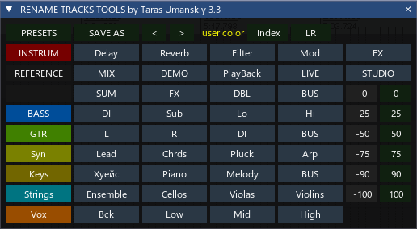

[⬅️ На главную (Main)](../README.md)

# 🎚️ Track GUI Tools

> **Мощный менеджер треков для REAPER с интерфейсом ReaImGui**

---

## 📝 Описание

**Track GUI Tools** — это комплексный скрипт для ускорения работы с треками в REAPER. Он предоставляет удобный графический интерфейс для пакетного переименования, покраски, панорамирования треков, а также мощную систему пресетов, позволяющую сохранять и мгновенно применять настройки треков.

---

## ✨ Основные возможности

### 🎨 Управление цветом и видом
- **Случайные цвета:** Быстрая покраска выбранных треков в случайные цвета.
- **Пользовательские цвета:** Установка конкретного цвета через HEX.
- **Градиент:** Возможность создания цветовых переходов (в зависимости от реализации).

### 🏷️ Продвинутое переименование
- **Пакетное переименование:** Присвоение имен сразу нескольким трекам.
- **Автоматическая индексация:** Добавление номеров к именам (например, `Guitar 1`, `Guitar 2`).
- **Обработка дубликатов:** Умное именование парных треков с суффиксами `L` и `R` (например, `Overhead L`, `Overhead R`).
- **Очистка имен:** Быстрое удаление текста из названий.

### 💾 Система пресетов
- **Сохранение конфигураций:** Сохранение имени, цвета и панорамы трека в пресет.
- **Drag & Drop:** Изменение порядка пресетов простым перетаскиванием.
- **Быстрая загрузка:** Применение пресета одним кликом.
- **Управление:** Редактирование и удаление существующих пресетов.

### 🎛️ Панорамирование
- **Быстрый Пан:** Кнопки для мгновенного панорамирования (Центр, Влево, Вправо).

---

## 🚀 Установка и требования

### Требования
1. **REAPER** (версия 6.0 или выше рекомендована).
2. **ReaImGui**: Расширение для отрисовки интерфейса (устанавливается через ReaPack).
3. **SWS Extension**: Рекомендуется для полной совместимости.

### Установка
1. Установите **ReaImGui** через ReaPack, если он еще не установлен.
2. Поместите файл `trs_TrackGUITools.lua` в папку скриптов REAPER.
   - *Обычно это:* `%AppData%\REAPER\Scripts`
3. Откройте Action List в REAPER (`?`).
4. Нажмите `New Action` -> `Load ReaScript`.
5. Выберите файл `trs_TrackGUITools.lua`.

---

## 📖 Руководство пользователя

### Интерфейс
Окно скрипта разделено на функциональные зоны:
1. **Верхняя панель:** Поле ввода имени трека и основные инструменты редактирования.
2. **Список пресетов:** Область с сохраненными кнопками-пресетами.

### Работа с пресетами
- **Создание пресета:** Настройте трек (имя, цвет, пан), выделите его и нажмите кнопку сохранения (или горячую клавишу `W` в окне скрипта).
- **Применение:** Кликните ЛКМ по кнопке пресета, чтобы применить настройки к выделенным трекам.
- **Редактирование:** ПКМ по пресету открывает контекстное меню для переименования или обновления параметров.
- **Удаление:** Alt + Клик (или через контекстное меню) удаляет пресет.
- **Сортировка:** Перетаскивайте кнопки пресетов мышкой, чтобы изменить их порядок.

### Горячие клавиши (в окне скрипта)
| Клавиша | Действие |
|:---:|:---|
| **W** | Сохранить новый пресет из выделенного трека |
| **S** | Сохранить текущие изменения (Save As / Settings) |

### Хранение данных
Скрипт сохраняет настройки и пресеты в текстовом файле, расположенном в папке `TrackPresets` рядом со скриптом. Это позволяет легко переносить настройки между компьютерами.

---

## 🛠️ Техническая информация

- **Файл настроек:** `TrackPresets/TrackPresets.txt` (автоматически создается).
- **API:** Использует нативный REAPER API и ReaImGui API.

---

## 📬 Контакты и поддержка

Если у вас возникли вопросы или предложения по улучшению скрипта:

- **VK:** [vk.com/tarasmetal](http://vk.com/tarasmetal)
- **Donation:** [Поддержать автора](https://vk.com/Tarasmetal)

---
