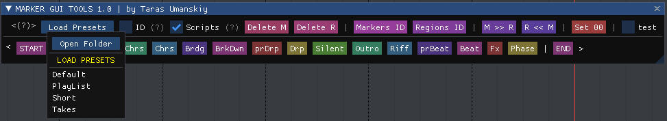
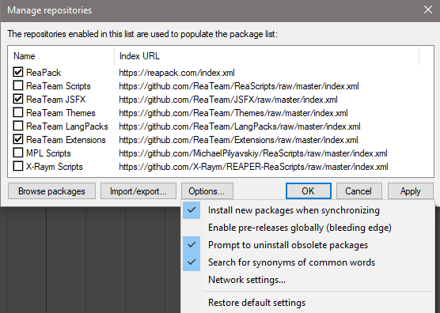
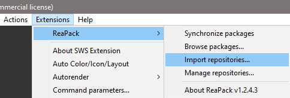
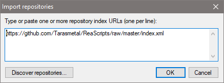

[comment]: <> ([Marker GUI Tools]&#40;https://github.com/Tarasmetal/ReaScripts/raw/master/GUI%20Tools&#41; создан для работы в [REAPER DAW]&#40;https://www.reaper.fm/download.php&#41; WIN & OSX.)
[Marker GUI Tools](https://github.com/Tarasmetal/ReaScripts/raw/master/GUI%20Tools) для работы в [REAPER DAW](https://www.reaper.fm/download.php) Windows.
======

🟢 Основная идея и задача скрипта — максимально сократить время на разметку проекта, оставляя его красивым и понятным для всех, а главное для самого себя.
Не отвлекайтесь от творческого процесса, перемещайтесь в любую точку проекта за пару секунд, чтобы записать, прослушать или внести корректировки в трекинг.

### ✅ **`Основные функции скрипта`**

- ---
- Загрузка и простое редактирование / создание пресетов.
- Старт скрипта с последнего выбранного пресета.
- ---
- Быстрая разметка проекта по шаблону.
- Добавление / удаление темп маркеров
- Добавление / удаление регионов на выделенном фрагменте
- Установка маркеров начала / конца проекта.
- Установка маркеров начала / конца проекта с помощью выделения 
- Установка нулевого 00:00:00 тайминга в любом месте проекта.
- Скрипт запоминает индексацию каждого повторяющегося имени.
- Возможность ( вкл / выкл ) индексацию / порядковый номер в имени.
- Возможность использовать кастомные кнопки с любыми lua скриптами / функциями.
- Удалить все маркеры / регионы.
- Пересчитать порядковые номера для маркеров / регионов.
- Конвертировать маркеры в регионы и обратно.

🔴     Чтобы скрипту было комфортно необходимы дополнительные библиотеки,
которые мы с вами и так используем в повседневной работе 🤝

### 🟢 **`Скачиваем и устанавливаем нужные библиотеки`**

📩 **WIN** Download: [SWS](https://sws-extension.org/) & [ReaPack](https://reapack.com/)

### 👀 **`Проверяем установку нужных репозиториев`** ВАЖНО 👇👇👇

### `💻 Запускаем REAPER`

В главном **МЕНЮ** (**File**, **Edit** и т.д) должен появится раздел с названием

`Extensions` > `ReaPack` > `Import repositories`

### `📤 Делаем импорт библиотеки`

Осталось вставить ссылку в окно импорта 👇👇👇

    https://github.com/Tarasmetal/ReaScripts/raw/master/index.xml

### 🟠 **Пример работы скрипта**

## `<3 Special THX:`

[**MPL**](https://vk.com/michael_pilyavskiy), [**SuperMaximus**](https://vk.com/maxsalkov), [**Aleksey** **Bezborodov**](https://vk.com/epitaph666).

###### **Обратная связь:** **[Vk](http://vk.com/tarasmetal)** • [**Instagram**](http://instagram.com/Tarasmetal)

