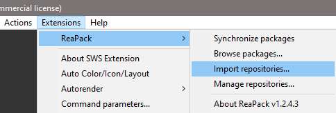

# ReaScripts by Taras Umanskiy

Коллекция Lua скриптов и GUI инструментов для [REAPER DAW](https://www.reaper.fm/), созданных для ускорения и улучшения рабочего процесса.

## 🛠️ Доступные инструменты (Available Tools)

Ниже представлен список основных инструментов с ссылками на подробную документацию.

| Инструмент | Описание | Документация |
| :--- | :--- | :---: |
| **Marker GUI Tools** | Скрипт позволяет максимально сократить время на разметку проекта, оставляя его красивым и понятным. Не отвлекайтесь от творческого процесса — перемещайтесь в любую точку проекта и ставте маркеры с уже подготовленными именами  за пару секунд. | [📖 Инструкция](DOC/trs_Marker%20GUI%20Tools.md) |
| **Track GUI Tools** | Скрипт предоставляет удобный интерфейс на базе ReaImGui для мгновенного переименования треков, управления их цветом и панорамой. Этот инструмент идеально подходит для звукорежиссеров и композиторов, которым необходимо быстро привести структуру проекта в порядок, используя гибкую систему пресетов и автоматизированные функции именования. | [📖 Инструкция](DOC/trs_Track%20GUI%20Tools.md) |
| **Label GUI Tools** | Инструменты для работы с текстовыми заметками и лейблами айтемов. | [📖 Инструкция](DOC/trs_Label%20GUI%20Tools.md) |
| **VST Macro Linker** | Скрипт для линковки параметров VST плагинов в макросы, включая линк с разных дорожек. | [📖 Инструкция](DOC/trs_VST%20Macro%20Linker.md) |
| **TCP/MCP Visible Tools** | Управление видимостью треков в окне аранжировки (TCP) и микшера (MCP). | [📖 Инструкция](DOC/trs_TCP%20MCP%20Visible%20Tools.md) |
| **Routing Tools (SendBox MODDED)** | Инструменты для быстрой и удобной маршрутизации (Sends/Receives). | [📖 Инструкция](DOC/trs_Routing%20Tools.md) |
| **PlayBack Routing** | Скрипт предназначен для автоматической маршрутизации (роутинга) треков в проекте на основе их имен. Это идеальный инструмент для быстрой настройки плейбэка (Playback) или подготовки мультитрека к выводу на физические выходы аудиоинтерфейса. | [📖 Инструкция](DOC/trs_PlayBack%20Routing.md) |
| **Track Mix Save/Restore** | Cкрипт позволяет **сохранять текущее состояние микса** (громкость, панорама, статус FX, автоматизация) в файл и **восстанавливать** его в любой момент. Это особенно полезно для: - **A/B сравнения**: быстрое переключение между текущим миксом и "сброшенным" состоянием. - **Подготовки стемов**: временное отключение обработок и выравнивание уровней. - **Экспериментов**: сохранение "точки возврата" перед внесением кардинальных изменений. | [📖 Инструкция](DOC/trs_Track%20vol%20pan%20fx%20auto%20Save%20Restore.md) |
| **Script Launcher** | Файловый менеджер для запуска скриптов с превью, избранным и историей. | [📖 Инструкция](DOC/trs_Script%20Launcher.md) |
| **Action List and toolbars Command ID name Fixer** | Конвертирует технические ID скриптов в читаемые имена на основе их описания в `reaper-kb.ini` и меню. | [📖 Инструкция](DOC/trs_Action%20List%20and%20toolbars%20Command%20ID%20name%20Fixer.md) |
| **Action List Script Path Scan and Fix** | Скрипт, который помогает поддерживать чистоту в Action List, выявляя и устраняя "битые" ссылки на скрипты. | [📖 Инструкция](DOC/trs_Action%20List%20Script%20Path%20Scan%20and%20Fix.md) |
| **Move Files to Region Folder** | Перемещает исходные файлы выбранных айтемов в подпапки, названные в честь регионов проекта. | [📖 Инструкция](DOC/trs_Move%20selected%20items%20files%20to%20region%20folder.md) |
| **Automation Mode Toggler** | Удобный GUI для переключения режимов автоматизации треков с функцией быстрого Toggle. | [📖 Инструкция](DOC/trs_Toggle%20track%20automation%20mode.md) |
| **Track Color Auto Loader** | Автоматическая окраска треков по именам и создание продвинутых градиентов для папок. | [📖 Инструкция](DOC/trs_Track%20color%20auto%20loader.md) |

---

## 📥 Установка (Installation)

---
<video src="https://github.com/Tarasmetal/ReaTest/raw/master/VIDEO/install.mp4" width="100%" controls></video>
---


Для корректной работы большинства скриптов необходимы установленные расширения [SWS Extension](https://sws-extension.org/) и [ReaPack](https://reapack.com/).

### Добавление репозитория в ReaPack

1. Запустите REAPER.
2. В главном меню перейдите: `Extensions` > `ReaPack` > `Import repositories...`

   [](img/repo_menu.png)

3. В появившемся окне вставьте ссылку на репозиторий:

   ```text
   https://github.com/Tarasmetal/ReaScripts/raw/master/index.xml
   ```

   [](img/repo_import.png)

4. Нажмите **OK**.
5. Теперь вы можете найти и установить инструменты через `Extensions` > `ReaPack` > `Browse packages...`.

[](img/repo.png)

---

### 📞 Обратная связь (Contact)

* **VK:** [vk.com/tarasmetal](http://vk.com/tarasmetal)
* **Instagram:** [@Tarasmetal](http://instagram.com/Tarasmetal)

Разработано с ❤️ для сообщества REAPER
