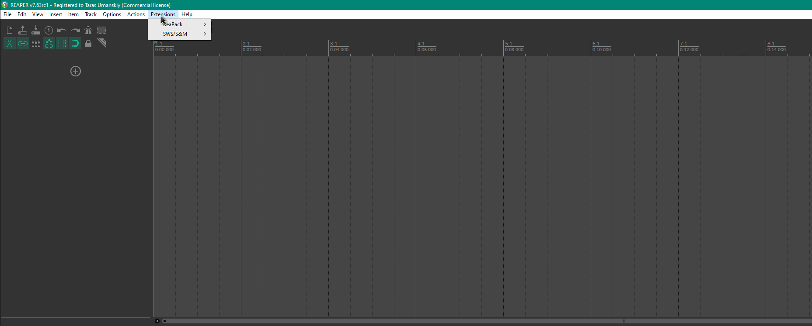
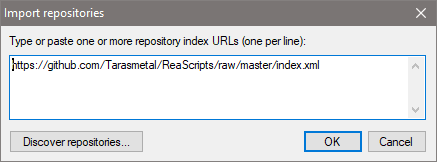
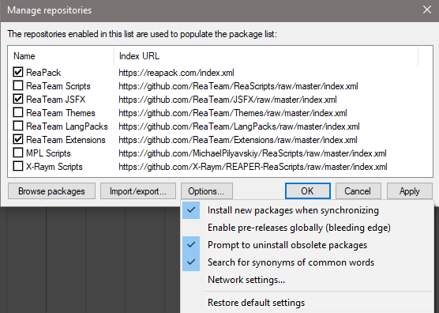

# ReaScripts by Taras Umanskiy

 -orange)  

[](README.md) [](README_ru.md)

I present to you **GUI Tools Pack** — a set of advanced scripts for [REAPER DAW](https://www.reaper.fm/), written in Lua using the **ReaImGui** library. This pack is designed to speed up routine tasks, improve navigation, and add new creative possibilities to your mixing and arranging workflow.
The documentation will be gradually updated and corrected, so don't hesitate to reach out for help or with suggestions.

---

## **Marker GUI Tools**
**Description:** This script minimizes the time spent marking up your project while keeping it visually clear and organized. Stay focused on your creative process — jump to any point in the project and insert markers with predefined names in seconds.

**[📖 Documentation](docs/trs_Marker%20GUI%20Tools.md)**


<!-- Video Window -->
<!-- <video src="https://github.com/Tarasmetal/ReaTest/raw/master/VIDEO/trs_Marker%20GUI%20Tools.mp4" width="100%" controls></video> -->

---

## **Track GUI Tools**
**Description:** A convenient interface for instantly renaming tracks, managing their colors, and panning. This tool is perfect for sound engineers and composers who need to quickly organize their project structure using a flexible preset system and automated naming functions.

**[📖 Documentation](docs/trs_Track%20GUI%20Tools.md)**


**Creating a new preset:**


<!-- Video Window -->
<!-- <video src="https://github.com/Tarasmetal/ReaTest/raw/master/VIDEO/trs_Track%20GUI%20Tools.mp4" width="100%" controls></video> -->

---

## **Label GUI Tools**
**Description:** Tools for working with text notes and item labels.

**[📖 Documentation](docs/trs_Label%20GUI%20Tools.md)**


<!-- Video Window -->
<!-- <video src="https://github.com/Tarasmetal/ReaTest/raw/master/VIDEO/trs_Label%20GUI%20Tools.mp4" width="100%" controls></video> -->

---

## **VST Macro Linker**
**Description:** A script for quickly linking VST plugin parameters to macros, including the ability to link from different tracks, including the master track.

**[📖 Documentation](docs/trs_VST%20Macro%20Linker.md)**


<!-- Video Window -->
<!-- <video src="https://github.com/Tarasmetal/ReaTest/raw/master/VIDEO/trs_VST%20Macro%20Linker.mp4" width="100%" controls></video> -->

---

## **TCP/MCP Visible Tools**
**Description:** A track visibility management system for the arrange view and mixer. Quickly hide/show tracks by their names for comfortable work with large projects.

**[📖 Documentation](docs/trs_TCP%20MCP%20Visible%20Tools.md)**


<!-- Video Window -->
<!-- <video src="https://github.com/Tarasmetal/ReaTest/raw/master/VIDEO/trs_TCP%20MCP%20Visible%20Tools.mp4" width="100%" controls></video> -->

---

## **Routing Tools (SendBox MODDED)**
**Description:** Tools for fast and convenient routing (Sends/Receives).

**[📖 Documentation](docs/Routing%20Tools.md)**


<!-- Video Window -->
<!-- <video src="https://github.com/Tarasmetal/ReaTest/raw/master/VIDEO/trs_Routing%20Tools.mp4" width="100%" controls></video> -->

---

## **PlayBack Routing**
**Description:** This script is designed for automatic track routing in the project based on their names. It's an ideal tool for quickly setting up playback or preparing a multitrack for routing to hardware audio interface outputs.

**[📖 Documentation](docs/trs_Playback%20HW%20Path%20Outputs.md)**


<!-- Video Window -->
<!-- <video src="https://github.com/Tarasmetal/ReaTest/raw/master/VIDEO/trs_PlayBack%20Routing.mp4" width="100%" controls></video> -->

---

## **Track Mix Save/Restore**
**Description:** This script allows you to **save the current mix state** (volume, pan, FX status, automation) to a file, then **reset these settings**, for example, to render the dry signal, and then **restore** them at any time.

**[📖 Documentation](docs/trs_Track%20vol%20pan%20fx%20auto%20Save%20Restore.md)**


<!-- Video Window -->
<!-- <video src="https://github.com/Tarasmetal/ReaTest/raw/master/VIDEO/trs_Track%20Mix%20Save%20Restore.mp4" width="100%" controls></video> -->

---

## **Script Launcher**
**Description:** A file manager for launching scripts with previews, favorites, and history.

**[📖 Documentation](docs/trs_Script%20Launcher.md)**


<!-- Video Window -->
<!-- <video src="https://github.com/Tarasmetal/ReaTest/raw/master/VIDEO/trs_Script%20Launcher.mp4" width="100%" controls></video> -->

---

## **Action List and toolbars Command ID Fixer**
**Description:** Converts technical script IDs into readable names based on their description in `reaper-kb.ini` and menus.

**[📖 Documentation](docs/trs_Action%20List%20and%20toolbars%20Command%20ID%20Fixer.md)**


<!-- Video Window -->
<!-- <video src="https://github.com/Tarasmetal/ReaTest/raw/master/VIDEO/trs_Command%20ID%20name%20Fixer.mp4" width="100%" controls></video> -->

---

## **Action List Script Path Scan and Fix**
**Description:** A script that helps keep the Action List clean by identifying and fixing "broken" script links.

**[📖 Documentation](docs/trs_Action%20List%20Script%20Path%20Scan%20and%20Fix.md)**


<!-- Video Window -->
<!-- <video src="https://github.com/Tarasmetal/ReaTest/raw/master/VIDEO/trs_Action%20List%20Script%20Path%20Scan%20and%20Fix.mp4" width="100%" controls></video> -->

---

## **Move Files to Region Folder**
**Description:** Moves source files of selected items into subfolders named after the project regions.

**[📖 Documentation](docs/trs_Move%20selected%20items%20files%20to%20region%20folder.md)**


<!-- Video Window -->
<!-- <video src="https://github.com/Tarasmetal/ReaTest/raw/master/VIDEO/trs_Move%20Files%20to%20Region%20Folder.mp4" width="100%" controls></video> -->

---

## **Automation Mode Toggler**
**Description:** A convenient GUI for toggling track automation modes with a quick toggle function.

**[📖 Documentation](docs/trs_Track%20automation%20mode%20toggle.md)**


<!-- Video Window -->
<!-- <video src="https://github.com/Tarasmetal/ReaTest/raw/master/VIDEO/trs_Automation%20Mode%20Toggler.mp4" width="100%" controls></video> -->

---

## **Track Color Auto Loader**
**Description:** Automatic track coloring by names and creation of advanced gradients for folders.

**[📖 Documentation](docs/trs_Track%20color%20auto%20loader.md)**


<!-- Video Window -->
<!-- <video src="https://github.com/Tarasmetal/ReaTest/raw/master/VIDEO/trs_Track%20Color%20Auto%20Loader.mp4" width="100%" controls></video> -->

---

# 📥 Installation



---
<!-- <video src="https://github.com/Tarasmetal/ReaTest/raw/master/VIDEO/install.mp4" width="100%" controls></video> -->
---

For most scripts to work correctly, you need to install the [SWS Extension](https://sws-extension.org/) and [ReaPack](https://reapack.com/).

## Adding the repository to ReaPack

1. Launch REAPER.
2. In the main menu, go to: `Extensions` > `ReaPack` > `Import repositories...`

   [](docs/repo_menu.png)

3. In the window that appears, paste the repository link:

   ```text
   https://github.com/Tarasmetal/ReaScripts/raw/master/index.xml
   ```

   [](docs/repo_import.png)

4. Click **OK**.
5. Now you can find and install the tools via `Extensions` > `ReaPack` > `Browse packages...`.

[](docs/repo.png)

---

## 📞 Contact

* **VK:** [vk.com/tarasmetal](http://vk.com/tarasmetal)
* **Instagram:** [@Tarasmetal](http://instagram.com/Tarasmetal)

---
Developed with ❤️ for the REAPER community