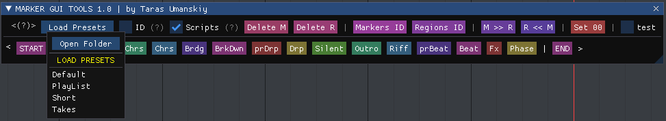
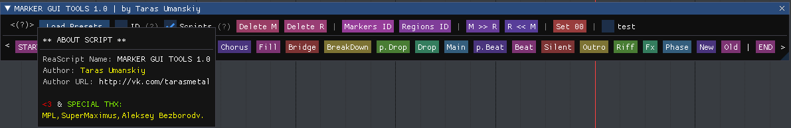

[⬅️ Main](../README.md)  

# 🤖 REAPER — Marker GUI Tools

> **A professional tool for working with markers and project navigation in REAPER.**  
> The script allows you to maximize time efficiency for project markup, keeping it neat and clear. Don't be distracted from the creative process — navigate to any point in the project and set markers with pre-prepared names in a couple of seconds.

<!--  -->

---

<!-- ## 📺 Video Demonstration -->

<!-- <video src="../img/trs_Marker GUI Tools.mp4" width="100%" controls></video> -->

---

## 🚀 Key Features

### 1. Marker Management
* **Quick Access**: Create markers with one click from a customizable list.
* **Drag & Drop**: Easily change the order of marker buttons in the interface simply by dragging.
* **START / END**: Special buttons to quickly set the start (`=START`) and end (`=END`) project markers.
* **Editing**:
    * **RMB (Right Mouse Button)** on a marker button opens the edit menu.
    * Change the name, color, delete, or insert new markers.
* **Markers Only (Mode 'H')**: Press the `H` key to hide all extra tools and leave only the marker buttons for a minimalistic view.

### 2. Presets and Settings
* **Preset System**: The script supports loading and saving marker sets.
    * Markers are stored in the `MarkerPresets` folder.
    * The current preset is remembered upon restart.
* **Color Setup**: You can customize the START/END button colors via the context menu.
* **Marker IDs**: The `ID` option allows hiding or showing marker identifiers in REAPER (via ExtState).

### 3. Additional Tools (Custom Buttons)
The script includes a powerful toolbar (hidden behind the `<` button), which provides access to SWS functions and custom actions:

| Group | Functions |
| :--- | :--- |
| **Set** | Set START/END to time selection. |
| **Delete** | Delete tempo markers, markers, or regions (by cursor or all). |
| **Convert** | Convert: Markers ↔ Regions. |
| **Renumber** | Renumber marker and region IDs. |
| **Index** | Add/remove indexes in marker names. |
| **Time** | Set 0:00:00, reset project time. |
| **PlayBack** | Tools for working with PlayBack (`PB` option). |

---

## 🎮 Controls and Hotkeys

### Keyboard
* **`H`** — Toggle "Markers Only" mode (Minimalist View).
* **`Esc`** — Close the script (if the window is in focus).

### Mouse
* **LMB (Left Click)** — Insert marker / Execute action.
* **RMB (Right Click)** — Context menu (Edit button, color, delete).
* **Drag & Drop** — Drag marker buttons to change their order.

---

## ⚙️ Installation and Requirements

For the script to work correctly, ensure you have installed:
1.  **ReaImGui**: Library for rendering the interface (installed via ReaPack).
2.  **SWS Extension**: Required for many marker and region management functions to work.

**File Structure:**
* `trs_Marker GUI Tools.lua` — Main script.
* `Functions/` — Folder with function libraries (`PresetFileLoadFunctions.lua`, `MarkerFunctions.lua`).
* `MarkerPresets/` — Folder for storing marker presets.

---

## 📜 Changelog

### v2.4
* `+` Added video demonstration to the documentation.

### v2.1.1
* `+` Fixed links and file names.

### v2.1
* `+` Added hotkey **"H"** to toggle minimalist mode (only markers are displayed).
* `+` **START/END** markers now use colors set in the GUI (customizable via RMB).
* `+` Code optimization.

---

  
Created with ❤️ by Taras Umanskiy

