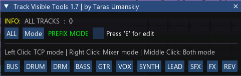

[⬅️ Main](../README.md)

 

# trs_TCP MCP Visible Tools

> **Professional Track Visibility Manager for REAPER.**  
> Instantly filter tracks in the Arrangement window (TCP) and Mixer (MCP) using customizable tag buttons.

---

---

| Information | Value |
| :--- | :--- |
| **Author** | Taras Umanskiy |
| **Version** | 1.10.1 |
| **Technology** | Lua, ReaImGui |
| **License** | MIT / Proprietary (see repository) |
| **Links** | [GitHub](https://github.com/Tarasmetal/ReaScripts) \| [Donation](https://vk.com/Tarasmetal) |

---

## 📖 Description

This script solves the navigation problem in large projects. Instead of manually searching for tracks, you can create buttons for each instrument group (e.g., `DRUM`, `BASS`, `VOX`) and instantly toggle visibility.

The tool's uniqueness lies in its flexible management of visibility zones: you can leave drums only in the mixer, vocals only in the arrangement, or focus on a group entirely by hiding everything else.

## ✨ Key Features

### 🎯 Smart Filtering
*   **Prefix Mode:** Search for tracks whose names *start* with a given word (e.g., "DRUM" will find "DRUM Kick", "DRUM Snare").
*   **Suffix Mode:** Search for tracks whose names *end* with a word (useful if you name tracks like "Kick (DRM)", "Snare (DRM)").

### 🖱️ Three Isolation Modes (Mouse Logic)
The script reacts differently to mouse click types, allowing you to manage TCP and MCP independently:

1.  **Left Click (TCP Mode):**
    *   Selected group stays in **TCP** (Arrangement). Other tracks are hidden from TCP.
    *   In the Mixer (MCP), **all** tracks remain visible.
2.  **Right Click (Mixer Mode):**
    *   Selected group stays in **MCP** (Mixer). Other tracks are hidden from the Mixer.
    *   In the TCP, **all** tracks remain visible.
3.  **Middle Click / Wheel (Both Mode):**
    *   Selected group is isolated **everywhere** (both in TCP and MCP).
    *   All other tracks are completely hidden.

### 🛠️ Full Customization (Edit Mode)
You don't need to dig into the code to change buttons. Press the **`E`** key to enter edit mode:
*   **Renaming:** Right-click a button -> change name.
*   **Sorting:** Drag & Drop buttons to change their order.
*   **Adding/Removing:** Add new tags or delete unnecessary ones via the context menu.
*   All settings are saved automatically to the `trs_TCP MCP Visible Tools.ini` file.

## 🎮 Controls and Hotkeys

| Key / Action | Function |
| :--- | :--- |
| **`E`** | Toggle Edit Mode for buttons |
| **`M`** | Toggle search mode (Prefix ↔ Suffix) |
| **`Esc`** | Close script |
| **Hold `Ctrl`** | Temporary switch to Suffix mode (while held) |
| **Hold `Shift`** | **Multi-selection Mode (Multi).** Adds group to already visible tracks without hiding others. |
| **Hold `Alt`** | Show all tracks (equivalent to the ALL button) |

## ⚙️ Requirements

The following extensions are required for the script to work:

1.  **REAPER** (version 6.x or 7.x).
2.  **ReaImGui**: UI rendering library (installed via ReaPack).

## 📂 File Structure

*   `trs_TCP MCP Visible Tools.lua`: Main script file.
*   `trs_TCP MCP Visible Tools.ini`: Configuration file (created automatically) where your buttons and their order are stored.

---

## Changelog
* **1.10.1**
    * Fixed links and filenames.
