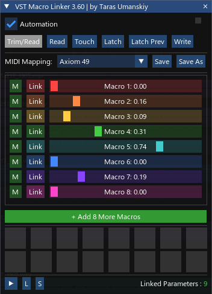

[⬅️ На главную (Main)](../README_ru.md)

 

# 🎛️ VST Macro Linker — Документация пользователя

**VST Macro Linker** — это мощный инструмент для REAPER DAW, предназначенный для управления параметрами VST-плагинов через макросы и пады. Скрипт позволяет создавать сложные связи, управлять ими с помощью внешних MIDI-контроллеров и автоматизировать процесс линковки.

---

## 🚀 Основные возможности
- **16 Макросов**: Плавное управление параметрами (Knobs/Sliders).
- **16 Падов**: Управление триггерами и переключателями (Buttons).
- **Автоматическая линковка**: Режим быстрого назначения параметров "на лету".
- **Интеллектуальная автоматизация**: Полная интеграция с JSFX-бэкендом для записи автоматизации.
- **Гибкое управление диапазоном**: Индивидуальные настройки Min/Max, инверсия и смещение (Offset) для каждой связи.
- **MIDI Learn**: Простая привязка вашего оборудования к интерфейсу скрипта.
- **Умное окно параметров**: Окно настроек теперь всегда под рукой, прикрепляясь к основному интерфейсу.

---

## 🛠️ Установка и настройка
1. Запустите скрипт `trs_VST Macro Linker.lua`.
2. При первом запуске (или при включении чекбокса **Automation**) скрипт предложит установить JSFX-бэкенд.
3. В проекте будет создана специальная дорожка `VST Macro Linker` с одноименным плагином. **Не удаляйте её**, если планируете записывать автоматизацию макросов.

---

## 🔗 Режимы линковки параметров

### 🖱️ Ручной режим
1. Коснитесь любого параметра в VST-плагине.
2. Нажмите кнопку **Link** рядом с нужным макросом в окне скрипта.

### ⚡ Авто-линковка (Auto-Link)
1. Нажмите горячую клавишу **L**. Появится индикатор `● AUTO-LINK ACTIVE`.
2. Просто крутите параметры в плагинах — они будут автоматически назначаться на свободные макросы.
3. **Выбор цели**: Нажмите цифры **1-9** на клавиатуре в этом режиме, чтобы зафиксировать линковку на конкретном макросе.
4. **Средняя кнопка мыши**: Клик по кнопке **Link** или **Pad** устанавливает их как следующую цель для авто-линковки.

---

## ⌨️ Горячие клавиши (Hotkeys)
| Клавиша | Действие |
| :--- | :--- |
| **L** | Включить/выключить режим Авто-линковки |
| **H** | Показать/скрыть окно настроек связей (Linked Parameters) |
| **1 - 9** | Выбрать целевой макрос в режиме Авто-линковки |
| **Ctrl + R-Click** | Включить/выключить MIDI Learn для выбранного Пада |

---

## 🖱️ Действия мышью
- **Левый клик (Link)**: Привязать последний затронутый параметр к макросу.
- **Средний клик (Link/Pad)**: Установить как цель для авто-линковки.
- **Правый клик (Link)**: Удалить все привязанные параметры с этого макроса.
- **Кнопка 'M' (Learn)**: Включить MIDI Learn для макроса (ожидание MIDI CC или Note).

---

## ⚙️ Окно Linked Parameters
Это окно позволяет детально настроить поведение каждого привязанного параметра:
- **Min / Max**: Установка диапазона движения параметра.
- **Invert**: Инвертирование направления (например, макрос вверх — параметр вниз).
- **Offset**: Смещение диапазона модуляции (только для макросов).
- **X**: Удаление конкретной связи.
- **L / S**: Загрузка и сохранение конфигурации связей в файл `.ini`.

> 💡 **Совет**: Окно автоматически примагничивается к правой стороне основного окна для удобства организации рабочего пространства.

---

## 🤖 Автоматизация
Скрипт поддерживает стандартные режимы автоматизации REAPER для макросов:
- **Read**: Чтение записанной автоматизации.
- **Touch / Latch**: Запись движений макросов.
- **Write**: Полная перезапись автоматизации.

Кнопки выбора режима находятся в верхней части интерфейса.

---

## 📂 Сохранение данных
- **Пресеты MIDI**: Сохраняются в папку `MacroPresets` внутри директории скрипта.
- **Данные проекта**: Все связи параметров сохраняются автоматически рядом с файлом проекта в формате `ИмяПроекта_ML.ini`.

---

Разработано с ❤️ для сообщества REAPER

